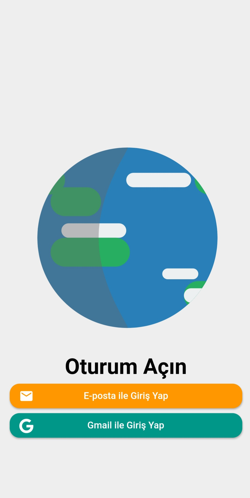
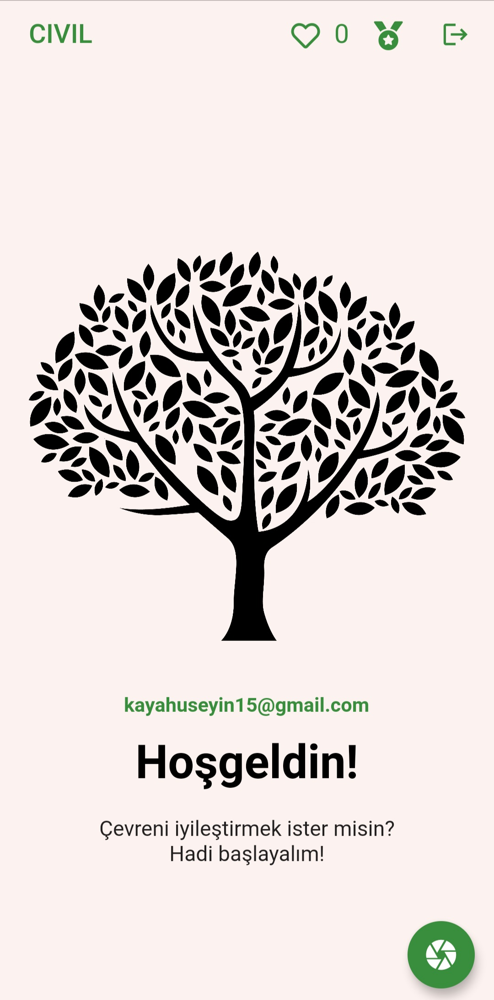
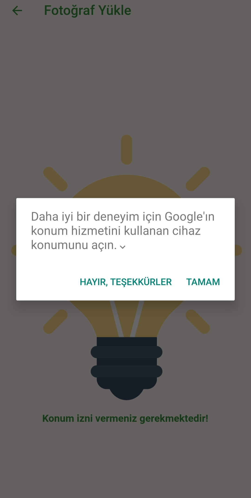
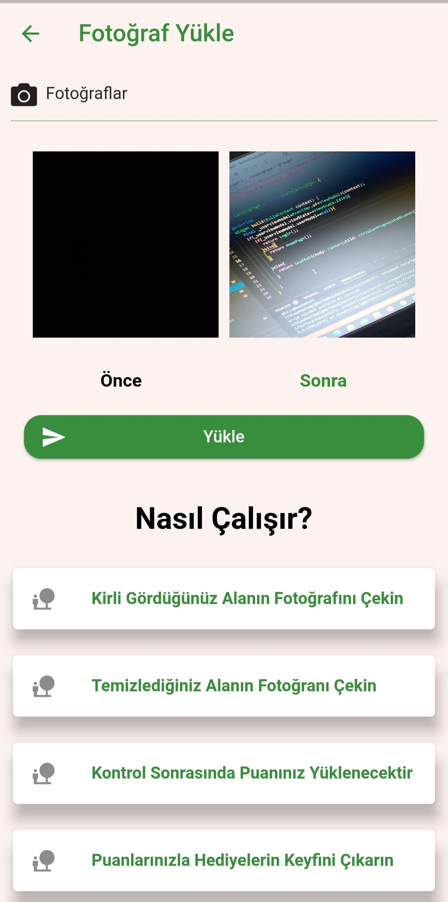
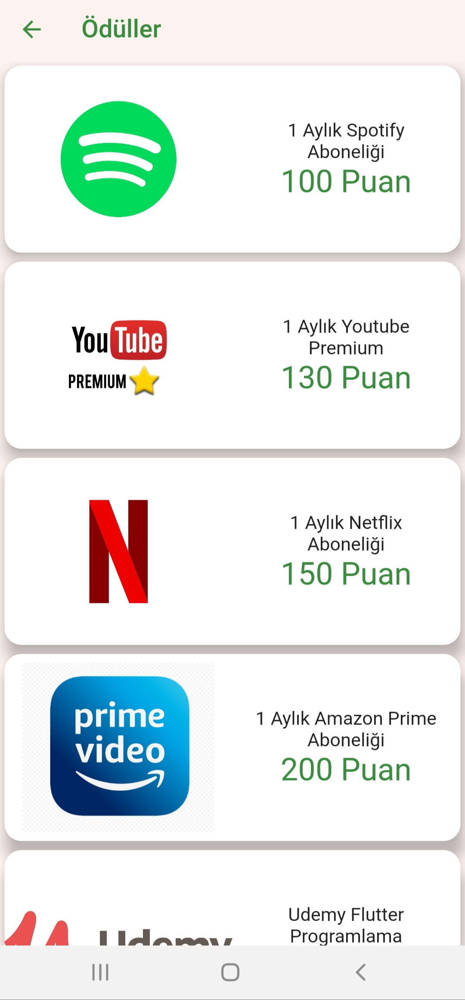
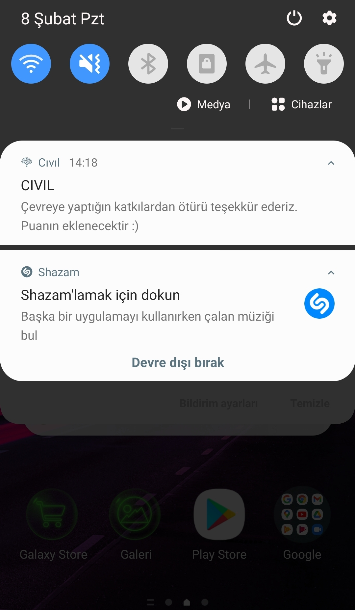

# Cıvıl

Cıvıl Flutter Hackathon kapsamında hazırlanmış SDG amaçlarını çözmek için oluşturulmuş bir uygulamadır. Kullanıcıların çevrede gördükleri çöp,atık vb. maddeleri öncesini ve sonrasını fotoğraflayarak gönderdikleri ve bunun karşılığında ödüller kazandıkları bir uygulamadır.Hem çevreyi korumayı hem de eğitim ödülleriyle yaşamboyu öğrenme kavramını desteklemektedir. Bu nedenle SDG'nın iki amacına da çözüm olmaktadır. 

# Services
Yapısında auth,db ve storage klasörlerini bulundurmaktadır. Burada hem abstract classlar hem de onlardan implemente alan servisler bulunmaktadır.

# Repository
Ara geçiş katmanıdır. Servislerin nereden alınacağını burası belirler. Ayrı bir servise geçildiğinde viewmodel ile serviceler arasında perde görevi görür

# ViewModel
Arayüzün dinlendiği ve ui ile repository arasındaki katmandır.

# Ui
Arayüz dosyalarını ve tasarımları içermektedir.

# ScreenShots
   
  

# Reference
For Rive Images
"WorldSpin" - **Argel Bejarano** 
"Light bulb on/off" - **Rick Borkhuis**

